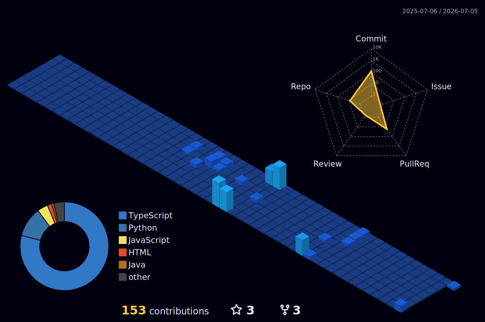

<h1 align="center">Hi, I'm Shanvin Luo 🌊</h1>

  

  
  
  
  

---

### 🧭 About me

Software engineering student at **Concordia University** (Co-op, 2022 to 2026) with 3+ years of
industry experience, currently at **Expedia Group** and previously architecting AI systems at
**Ericsson**. Based in Montreal, Canada.

- 💼 Incoming SWE Intern at **Shopify** (Fall 2026) · **Expedia Group** (current) · past: Ericsson, CIMA+, McKesson, Alvia Systems, Pomerleau
- 🏆 3x MLH hackathon winner, including Best Use of Gemini API and Best Use of MongoDB Atlas
- 🗣️ English · French · Mandarin · Spanish (intermediate) · Japanese (beginner)
- 🌐 Explore my work as an interactive underwater dive at **[shanvinluo.ca](https://shanvinluo.ca)**

### 🛠️ Tech toolbox

**Languages**  

**Frameworks & libraries**  

**AI & data**  

  
Gemini · OpenAI · RAG / Vector Search · OpenWebUI · Scrapy · BeautifulSoup · yfinance

**Tools & platforms**  

### 💼 Experience

- **Expedia Group** · Software Developer Intern *(2026 to present)*: Mobile shopping platform; container migration in Swift + Kotlin
- **Ericsson** · Solutions Architect Intern *(2025 to 2026)*: GPU-powered system architecture; AI-agentic VS Code extension (44 features, hundreds of engineers); ClickHouse + PostHog analytics
- **CIMA+** · AI Software Developer *(2025)*: ETL + Azure crawlers; FastAPI LLM memory; authored a 30+ page AI guide and trained 500+ staff
- **McKesson Canada** · Automation Developer Intern *(2024)*: Python/VBA automation delivered 4 months early; cut manual effort 50%
- **Alvia Systems** · Software Developer Intern *(2024)*: AI and drone software; fuzzy-logic fire-spread simulator
- **Pomerleau** · Software Developer Intern *(2023)*: Backend in C# / ASP.NET / EF Core; Figma redesign cut UI defects 95%

### 🚀 Featured projects

| Project | What it is |
| --- | --- |
| 🤿 **[Deep Dive](https://shanvinluo.ca)** · [code](https://github.com/shanvinluo/personal_portfolio) | My portfolio as a scroll-driven 3D descent through the ocean zones (Three.js · React Three Fiber · GLSL) |
| 🛰️ **Orbit** · *MLH Best Use of Gemini API* | 3D graph of S&P 500 corporate and board relationships, with Gemini AI and live news |
| 💬 **Socratic** · *MLH Best Use of MongoDB Atlas* | VS Code mentor that teaches with questions via MongoDB Vector Search + RAG |
| 🗺️ **University Maps App** | Led a 10-person Agile team on a React Native campus navigator; +30% velocity, 40% fewer production bugs |

### 📊 At a glance

  
  
  
  

### 🌃 Contribution skyline

  

